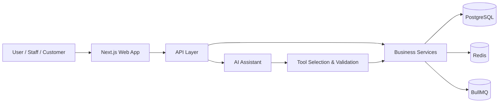

# Business OS

Business OS is a multi-tenant, AI-powered operating system for African SMEs. It is designed to be the daily operating layer for running a business, not another rigid ERP.

> Business OS is the product. AI is a subsystem that helps users work with business data safely and naturally.

## Overview

Business OS gives small and medium businesses a unified platform to manage:

- customers
- suppliers
- products and categories
- inventory
- sales
- invoices
- payments
- expenses
- reports

The platform is built around a simple promise:

- every business action should happen once
- every business question should be answerable instantly
- the database is the source of truth

## Vision

Business OS exists to make everyday business operations more intelligent, more transparent, and more efficient. The platform should help business owners and teams answer questions instantly, execute workflows safely, and gain better visibility without relying on fragmented tools.

## Product Philosophy

Business OS is founded on the following principles:

- modular architecture
- domain-driven design
- multi-tenancy by default
- RBAC and permission-based authorization
- audit logging and observability
- event-driven business actions
- secure-by-default design
- documentation-first development

## Key User Stories

- A business owner asks, “Who owes me money?” and receives a grounded answer from live business data.
- A store manager asks, “Which products are almost finished?” and gets a real-time inventory summary.
- An accountant records “today’s fuel expense” and the system captures it through a validated workflow.
- A customer browses a business storefront, places an order, and tracks the transaction end to end.

## Solution Architecture Summary



## Core Platform Capabilities

### Business Operations

- customer management
- supplier management
- product and category management
- inventory tracking
- sales workflows
- invoices and payments
- expense tracking
- reporting and dashboarding

### AI Assistant

- natural language interaction
- tool/function calling
- permission-aware actions
- business data grounding
- audit-backed responses

### Customer Portal

- business browsing
- product viewing
- order placement
- order tracking
- invoice viewing
- payment actions

## Technology Stack

| Layer | Technology |
| --- | --- |
| Frontend | Next.js, React, TypeScript, Tailwind CSS, shadcn/ui |
| Data and Forms | TanStack Query, TanStack Table, React Hook Form, Zod |
| Backend | Next.js, Drizzle ORM, PostgreSQL, Redis, BullMQ |
| Authentication | Better Auth |
| Storage | Cloudflare R2 |
| Deployment | Docker, Neon, Vercel |
| AI | Google Gemini |

## Monorepo Structure

```text
apps/
  web/
  docs/
packages/
  auth/
  ai/
  database/
  permissions/
  shared/
  ui/
  validation/
  utils/
docs/
```

## Documentation Set

This repository is intended to be documented before implementation begins. The documentation set includes:

- [docs/PROJECT_VISION.md](docs/PROJECT_VISION.md)
- [docs/ARCHITECTURE.md](docs/ARCHITECTURE.md)
- [docs/ROADMAP.md](docs/ROADMAP.md)
- [docs/DATABASE_SCHEMA.md](docs/DATABASE_SCHEMA.md)
- [docs/PERMISSION_MATRIX.md](docs/PERMISSION_MATRIX.md)
- [docs/API_SPECIFICATION.md](docs/API_SPECIFICATION.md)
- [docs/CODING_STANDARDS.md](docs/CODING_STANDARDS.md)
- [docs/CONTRIBUTING.md](docs/CONTRIBUTING.md)
- [docs/DECISIONS.md](docs/DECISIONS.md)
- [docs/MVP_CHECKLIST.md](docs/MVP_CHECKLIST.md)
- [docs/GLOSSARY.md](docs/GLOSSARY.md)

## Implementation Status

This repository currently contains documentation only. No application code, UI components, API endpoints, or database migrations are included.

## Principles for Implementation

- build the core business domain first
- enforce tenant isolation at every layer
- use permission-based authorization rather than role-name checks
- keep AI actions routed through validated business services
- preserve auditability for business-critical events

## Contributing

Contributions should focus on improving the architecture, documentation quality, or implementation readiness. Please review [docs/CONTRIBUTING.md](docs/CONTRIBUTING.md) before proposing changes.

## License

This documentation and architecture proposal is intended for open-source collaboration. A final license should be selected before public release.
