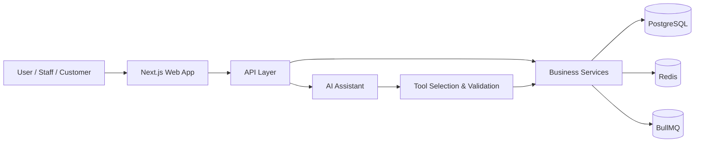
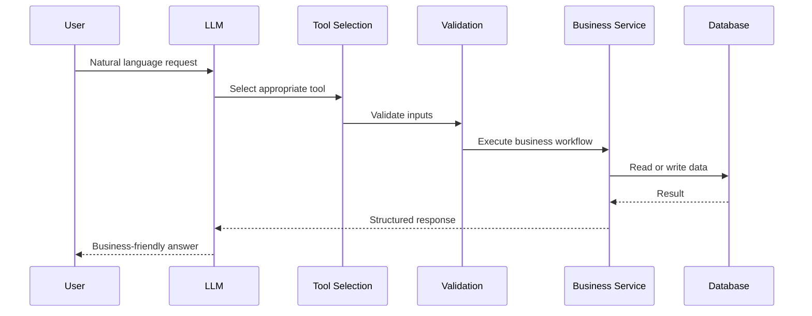

# Architecture

## Purpose

This document describes the architecture for Business OS as a production-grade, multi-tenant SaaS platform. The architecture is intended to support long-term growth, team collaboration, business integrity, and AI-assisted workflows without compromising security or tenant isolation.

## Architecture Goals

- support multi-tenant operations safely and predictably
- enforce secure authorization and auditability
- keep AI actions governed through business services
- maintain modular domain boundaries
- scale from MVP to enterprise workloads
- preserve strong type safety and documentation discipline

## System Context



## Architectural Principles

- Modular architecture
- Domain-driven design
- Multi-tenancy
- RBAC and permission-based authorization
- Audit logging
- Event-driven business events
- Type-safe APIs
- Secure by default
- Scalable architecture
- Clean code and SOLID principles
- Documentation-first development

## High-Level Layers

### 1. Presentation Layer
The web application provides the primary experience for staff and business users. It should be built using Next.js, React, TypeScript, Tailwind CSS, shadcn/ui, and supporting libraries for data handling and form validation.

### 2. API Layer
The API layer is responsible for request validation, authentication, authorization, orchestration, and response shaping. It should route traffic to business services and normalize error handling.

### 3. Domain Layer
The domain layer hosts the primary business rules and workflows. It contains services for customers, suppliers, inventory, sales, invoices, expenses, reporting, and AI-assisted operations.

### 4. Data Layer
The data layer persists system state in PostgreSQL and handles read/write operations through a typed data access layer. Redis supports caching and transient state, while BullMQ supports asynchronous work.

## Monorepo Structure

```text
apps/
  web/
  docs/
packages/
  auth/
  ai/
  database/
  permissions/
  shared/
  ui/
  validation/
  utils/
docs/
```

## Module Boundaries

| Module | Responsibility |
| --- | --- |
| Authentication | sign-in, session handling, identity verification |
| Business Management | tenant configuration and business profile |
| Customers | customer records and related workflows |
| Suppliers | supplier records and supply workflows |
| Products | catalog, pricing, and product metadata |
| Inventory | stock movement and inventory control |
| Sales | order and sales processing |
| Invoices | invoice generation and lifecycle |
| Payments | payment capture and reconciliation |
| Expenses | expense capture and approvals |
| Reports | analytics, summaries, and operational views |
| AI Assistant | grounded natural language business assistance |
| Audit & Events | change history and event dissemination |

## Multi-Tenancy Model

Business OS is a true multi-tenant platform. Every business is a tenant. Every tenant has its own data domain and its own authorization boundary.

### Requirements

- every request must resolve the active tenant
- every data access layer call must be tenant-scoped
- tenant ownership is enforced in the database access layer and service layer
- cross-tenant data access is impossible by design

### Tenant Isolation Pattern

```text
Request -> Resolve Tenant -> Validate Identity -> Load Permissions -> Query Scoped Data -> Execute Business Service -> Persist -> Audit
```

## Authorization Model

Business OS uses permission-based authorization instead of role-name checks. Roles are used only as convenience groupings for assignment, while the enforcement point is always permission evaluation.

### Example Permissions

- customer.read
- customer.create
- customer.update
- customer.delete
- inventory.read
- inventory.adjust
- invoice.create
- invoice.read
- expense.create
- report.read
- settings.update

## AI Architecture

The AI subsystem does not access the database directly. It interacts through validated tools and business services.



### AI Design Rules

- the AI must never write directly to the database
- every action must pass through a validated tool contract
- the AI should act as a business assistant, not a chatbot
- assistant responses must be grounded in business data and audit history

## Data Architecture

PostgreSQL is the system of record. Drizzle ORM is used for schema management and typed queries. Redis supports caching and short-lived state. BullMQ supports asynchronous task processing.

### Core Data Domains

- tenants
- users
- roles
- permissions
- customers
- suppliers
- products
- categories
- inventory movements
- sales
- invoices
- payments
- expenses
- reports
- audit logs
- events

## API Design Conventions

The system should use typed, well-structured API contracts.

### Conventions

- use consistent resource-oriented naming
- prefer explicit action endpoints for complex workflows
- validate request shape on the server
- return structured errors and correlation IDs
- preserve tenant context in every request

### Example Endpoint Conventions

- /api/tenants/:tenantId/customers
- /api/tenants/:tenantId/products
- /api/tenants/:tenantId/invoices
- /api/tenants/:tenantId/ai/assistant

## Event and Audit Model

The platform should emit business events for critical operations such as order creation, invoice creation, inventory adjustments, payment confirmations, expense approval, and permission changes.

### Audit Requirements

- actor identity
- tenant context
- action type
- entity affected
- timestamp
- before/after values where appropriate
- correlation ID

## Security Architecture

Security must be designed into the system from the start.

### Controls

- tenant-scoped queries everywhere
- strict authorization checks on the server
- input validation and output sanitization
- role and permission separation
- secure session handling
- encrypted storage for sensitive data where appropriate
- observability for suspicious access patterns

## Scalability Strategy

The architecture should support growth through modular decomposition, queue-based background execution, and stateless application deployment patterns.

### Growth Plan

1. start with a focused MVP
2. scale application instances horizontally as traffic grows
3. offload asynchronous workloads via queues
4. introduce reporting optimization as data volume increases
5. expand module capabilities without changing the tenancy model

## Deployment Strategy

The recommended production deployment model is:

- Docker for consistent runtime packaging
- Neon for PostgreSQL
- Vercel for application delivery
- Cloudflare R2 for object storage
- Redis and BullMQ for background processing

## Summary

Business OS should be implemented as a secure, modular, multi-tenant platform where business workflows are reliable, AI assistance is controlled, and operational visibility is built into the architecture from day one.
