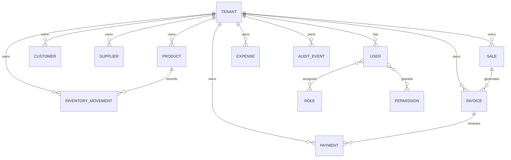

# Database Schema

## Overview

The database is the system of record for Business OS. Every business action that changes state should be represented in a relational schema with strong tenant boundaries and clear audit history.

## Design Principles

- tenant-scoped data access
- explicit ownership of records
- immutable audit trail where appropriate
- normalized core entities
- support for event generation
- typed and versioned schema evolution

## Core Schema Domains

## Core Tables

| Table | Purpose |
| --- | --- |
| tenants | represents a business tenant |
| users | authenticated users within a tenant |
| roles | role definitions and assignments |
| permissions | fine-grained permission definitions |
| customers | customer records owned by a tenant |
| suppliers | supplier records owned by a tenant |
| products | catalog records with pricing and inventory semantics |
| categories | product grouping and taxonomy |
| inventory_movements | stock increases and decreases |
| sales | sales orders and transactions |
| invoices | invoice records and status |
| payments | payment events linked to invoices |
| expenses | expense records and approvals |
| audit_events | immutable change and workflow history |
| events | domain event emission table |

## Tenant Model

The tenants table should contain the business identity and default configuration for a business workspace.

### Recommended Fields

- id
- slug
- name
- status
- currency
- timezone
- locale
- created_at
- updated_at

## Users and Identity

Users belong to a tenant and may have multiple role assignments or direct permission grants.

### Recommended Fields

- id
- tenant_id
- name
- email
- avatar_url
- status
- created_at
- updated_at

## RBAC Model

The authorization model should separate roles from permissions. Roles are convenience groupings; permissions are the actual enforcement primitive.

### Recommended Fields

- role_id
- role_name
- description
- is_system_role

### Permission Relationship

- user_permissions table for direct grants
- role_permissions table for role-based permission bundles
- user_roles table for user-to-role assignment

## Business Domain Tables

### Customers

- id
- tenant_id
- name
- email
- phone
- address
- status
- created_at
- updated_at

### Suppliers

- id
- tenant_id
- name
- contact_name
- email
- phone
- address
- status
- created_at
- updated_at

### Products

- id
- tenant_id
- category_id
- sku
- name
- description
- unit_price
- cost_price
- stock_quantity
- track_inventory
- status
- created_at
- updated_at

### Categories

- id
- tenant_id
- name
- parent_id
- created_at
- updated_at

### Inventory Movements

- id
- tenant_id
- product_id
- movement_type
- quantity
- reason
- reference_type
- reference_id
- created_by
- created_at

### Sales

- id
- tenant_id
- customer_id
- status
- subtotal
- tax
- total
- created_by
- created_at
- updated_at

### Invoices

- id
- tenant_id
- sale_id
- invoice_number
- status
- due_date
- total_amount
- balance_due
- created_by
- created_at
- updated_at

### Payments

- id
- tenant_id
- invoice_id
- payment_method
- amount
- reference
- status
- created_by
- created_at

### Expenses

- id
- tenant_id
- description
- amount
- expense_date
- category
- payment_method
- created_by
- created_at
- updated_at

## Audit and Event Tables

### Audit Events

- id
- tenant_id
- actor_id
- action
- entity_type
- entity_id
- metadata
- created_at

### Events

- id
- tenant_id
- event_name
- aggregate_type
- aggregate_id
- payload
- created_at

## Database Constraints and Practices

- every table should include tenant_id unless explicitly exempted
- indexes should be created for tenant-scoped lookups and active record queries
- unique constraints should avoid collisions across tenants
- soft deletes should be considered for business entities where appropriate
- audit events should be append-only and not rewritten
